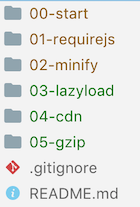
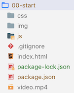

# Performance JavaScript Part - 2
## Improve web app performance with various techniques. (1.1MB down to ~0kB)
- JavaScript Dependency Loader
- Minify-cation (JavaScript & CSS)
- Lazy-loading (JavaScript & CSS)
- CDN Content Delivery Network (JavaScript & CSS)
- Gzip Compress (JavaScript & CSS)
- Browser Cache
<details>
<summary>Note: Other performance enhancements techniques </summary>

> Not demonstrated in this exercise.
- Bundling (JavaScript & CSS)
- HTTP2
- Service workers
- Offline support
- JavaScript best practices
- Server rendering.
</details>

## Development Environment Setup
- Install [Google Chrome](https://www.google.com/chrome/)
- Install [NodeJS](https://nodejs.org/en/) Current
- Install [Git](https://git-scm.com/downloads) for your Operating System
- Install [VSCode](https://code.visualstudio.com/)
- Install [VSCode Extensions](https://marketplace.visualstudio.com)
- Install npm packages globally (all packages in one command)
    1. Open VS Code | View menu | Terminal menu item. copy & paste this command in the terminal:
        ```
        npm install gulp gulp-clean-css gulp-uglify gulp-concat serve http-server -g
        ```
        <details>
        <summary>Note: Optional steps to install previous packages one by one.</summary>

        >  you could install one by one each of the previous listed packages by running these commands:
        ```JavaScript
        //to use gulp automation tool
        npm install gulp -g
        //to minify CSS
        npm install gulp-clean-css -g
        //to minify JavaScript
        npm install gulp-uglify -g
        //to bundle CSS or JavaScript
        npm install gulp-concat -g
        //development web server with live updates
        npm install serve -g
        //development web server with gzip support
        npm install http-server -g
        ```
        </details>
        <details>
        <summary>Note: Optional steps to install other recommended packages.</summary>

        >  you could install other recommended package by running these commands:
        ```JavaScript
        //to use TypeScript programming language
        npm install typescript -g
        //to use Angular Command Line Interface (Code Generation)
        npm install @angular/cli -g
        ```
        </details>
<details>
<summary>Note: Optional steps to verify your environment configuration.</summary>

> Verify your environment configuration by typing thesecommands in your terminal
```JavaScript
//verify NodeJS is install and ready
node -v
//verify npm is install and ready
npm -v
//verify git is install and ready
git --version
```
</details>
<details>
<summary>Note: Optional steps to install recommended VS Code Extensions.</summary>

> Recommended VS Code extensions for Angular, .Net Core, and Azure support:
1. Open VS Code | Extensions (left button bar) search for and install:
2.  [Angular Essentials](https://marketplace.visualstudio.com/items?itemName=johnpapa.angular-essentials) pack by John Papa
3. [Auto Close Tag](https://marketplace.visualstudio.com/items?itemName=formulahendry.auto-close-tag) by Jun Han
4. [Auto Rename Tag](https://marketplace.visualstudio.com/items?itemName=formulahendry.auto-rename-tag)
5. [Azure Tools](https://marketplace.visualstudio.com/items?itemName=ms-vscode.vscode-node-azure-pack)
6. [Beautify](https://marketplace.visualstudio.com/items?itemName=HookyQR.beautify)
7. [Bracket Pair Colorizer 2](https://marketplace.visualstudio.com/items?itemName=CoenraadS.bracket-pair-colorizer-2)
8. [VS Live Share Extension Pack](https://marketplace.visualstudio.com/items?itemName=MS-vsliveshare.vsliveshare-pack)
9. [.NET Core Extension Pack](https://marketplace.visualstudio.com/items?itemName=doggy8088.netcore-extension-pack)
</details>

## Get project code
In VS Code open your workspace folder. In Terminal Copy & paste this command/s:

<details>
<summary>Note: Optional steps for first time using git in this computer.</summary>

> You only need to set your global settings once.
```JavaScript
//Only first time git users, configure your global settings
-git config --global user.email "youremail@domain.ext"
-git config --global user.name "First Last"
```
</details>

```
git clone https://github.com/AngelValdes/Performance-JavaScript-Part2.git
```
This will create a folder called "Performance-JavaScript-Part2" in your workspace and download the code inside of it. I recommend closing VS Code Folder "your workspace" and open this project specific folder "Performance-JavaScript-Part2". That will set VS Code context to this project.

## Project Structure
> List of projects in folders. All folder contain a copy of the previous folder with the new performance enhancement technique added to it. The actual application assets and funtionality stays the same.




Each project contains the tipical css, img, js folders to organize those files, and the index.html, package.json, and .gitignore in the root of the application. Some projects will have additional files to support tools and libraries.

## Part A - Various libraries (traditional Web App)
JQuery for DOM manipulation, UnderscoreJS for Utilities, VideoJS for more video features
1. Verify current configuration. In VS Code ...
    - Look at the index.html for several JavaScript dependencies and script references
    - Look at app.js for functionality
2. In VS Code Terminal, Change to folder 00-start, then load the development server by typing:
    ```
    serve
    ```
    - Navigate to the application hosted address... something like http://localhost:5000
    - Look at devTools by pressing F12 in Chrome browser, and refresh (Transferred Size: 1.1MB)
## Part B - Dependency loader
1. In VS Code Terminal, stop development server by pressing:
    ```
    CTRL+C
    ```
2. In VS Code Expand 01-requirejs folder and verify current configuration
3. Verify current configuration
    - Look at index.html for only one js reference (requirejs)
    - Look at config-require.js for dependency configuration
    - Look at the app.js and it will now use require to load all dependencies
    - In VS Code Terminal, Change to folder 01-requirejs and load development server.
    ```
    serve
    ```
    - Navigate to the application hosted address... something like http://localhost:5000
    - Look at devTools by pressing F12 in Chrome browser, and refresh (Transferred Size: 1.2MB)
    - Look at devTools, downloaded requests, more spread out, require loads them.

## Part C - Minify
1. In VS Code Terminal, stop development server by pressing:
    ```
    CTRL+C
    ```
2. In VS Code Expand 02-minify folder and verify current configuration
    - Look at gulpfile.js for task automation (minify css and javascript into dist folder)
    - Look at index.html for reference to dist folder
    - Look at config.require.js for reference to dist folder
    - Look at package.json defined dependencies. Dependency libraries defined in package.json were already installed globaly in the project setup section above.
    - Look at gulpfile.js for tasks configuration to minify css and JavaScript from original folders to "dist" folder.
3. In VS Code Terminal, Change to folder 02-minify and execute "default" task defined in gulpfile.js
    ```
    gulp
    ```
    - Look at dist folder for compressed files
4. In VS Code Terminal, load development server.
    ```
    serve
    ```
     - Navigate to the application hosted address... something like http://localhost:5000
    - Look at devTools by pressing F12 in Chrome browser, and refresh (Transferred Size: 428kB)

## Part D - Lazy Loading
1. In VS Code Terminal, stop development server by pressing:
    ```
    CTRL+C
    ```
2. In VS Code Expand 03-lazyload folder and verify current configuration
    - Look at app.js for multiple requires at different points of the app functionality
 3. In VS Code Terminal, Change to folder 03-lazyload and execute "default" task defined in gulpfile.js
    ```
    gulp
    ```
4. In VS Code Terminal, load development server.
    ```
    serve
    ```
     - Navigate to the application hosted address... something like http://localhost:5000
    - Look at devTools by pressing F12 in Chrome browser, and refresh (Transferred Size: 104kB)

## Part E - CDN (Content Delivery Network)
1. In VS Code Terminal, stop development server by pressing:
    ```
    CTRL+C
    ```
2. In VS Code Expand 04-cdn folder and verify current configuration
    - Look at config-require.js for references to CDN locations
3. In VS Code Terminal, Change to folder 04-cdn and execute "default" task defined in gulpfile.js
    ```
    gulp
    ```
4. In VS Code Terminal, load development server.
    ```
    serve
    ```
     - Navigate to the application hosted address... something like http://localhost:5000
    - Look at devTools by pressing F12 in Chrome browser, and refresh (Transferred Size: 49.2kB)
    > Note: Using JavaScript libraries from CDN for performance improvement is only clear when using implicit browser caching.

## Part F - Gzip (Compress HTML, CSS, JavaScript)
Browser sends header that accepts gzip: "Accept-encoding: gzip, deflate” (no quotes)

Server uses gzip compression for response if browser supports it. I will simulate gzip process by creating compressed index.html manually on https://online-converting.com/archives/convert-to-gzip/ and copy file with gz extension in same folder. Server will serve it if configured to do so.
1. In VS Code Terminal, stop development server by pressing:
    ```
    CTRL+C
    ```
2. In VS Code Expand 05-gzip folder and verify current configuration
    - Look at index.html.gz file at the same location than index.html
3. In VS Code Terminal, Change to folder 05-gzip and execute "default" task defined in gulpfile.js
    ```
    gulp
    ```
4. In VS Code Terminal, load development server with gzip support.
    ```
    http-server -g
    ```
     - Navigate to the application hosted address... something like http://127.0.0.1:8080
    - Look at devTools by pressing F12 in Chrome browser, and refresh (Transferred Size: 38.2kB)

## Part G - Browser Cache
* Enable cache on devTools and refresh
* Size: 0.2 kB (cached)
